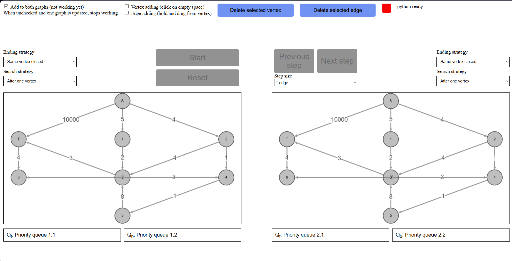

This is a README for a web app which is part my bachelor thesis.

The web app is for visualising the different versions of a bidirectional Dijkstra algorithm.

If you encounter any errors during the usage of the app or you have any ideas for improving the app, reach out to me via email: arnost.rubas@gmail.com

1 - graphs

    you can rearrange the graph however you like, it wont be changed (unless you reload the page)

    the color of the node is split into two halfs. Left half represents forward search, right half represents backward search
    
    gray - node is unvisited in forward/backward search

    yellow - node is open in the forward search
    red - node is closed in the forward search
    green - node is open in the backward search
    purple - node is closed in the backward search

    at the end of the algorithm, the final path (all its nodes and edges) is colored blue

2 - priority queues

    forward and backward priority queues are shown here. The format is label with upper index, which indicates the priority of the vertex

3 - part when you can select what version of the algorithm is used

    if Dijkstra algorithm is selected in atleast one of the strategies, Dijkstra algorithm is used
    when not using Dijkstra, the two selected strategies are used

4 - Main buttons

    Start - calculates the algorithms and starts the visualisation. Once started, the Next/Previous buttons are enabled

    Reset - Resets the calculation, allows graph changes - see part 5

    Next step - shows next step. The node that was changed is momentaraly highlighted by a red ring (if the color isnt changed, check priority queues)

    Previous step - shows previous step

    Step size - selection of the visualisation, user can either see the algorithm step by step, or just the full path

5 - buttons and checkboxex that allow user to change the graph

    allowed only before starting the calculation

    checkbox add to both graphs - !!!NOT IMPLEMENTED!!!!

    Vertex adding - when checked, user can click at a free space inside the graph and new vertex will be generated

    Edge adding - when checked, user can add edges from two nodes by holding from a source vertex and the draging to end node

    when either of these two is selected, moving the graph/nodes around may not work

    Delete selected vertex - when user selects a node (by clicking on it and it being highligted in blue) he can remove this node (and all edges leading from/to this node) by clicking this button

    Delete selected edge - similar to vertex deleting

    python ready - since the webapp uses python for calculations, it is necessary to wait for the python script to load. Turns green when python is succesfully loaded. Start is enabled after python is loaded

