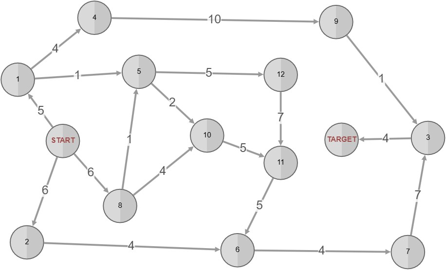

# Less open vertexes example
Screenshot of the graph:

This is a graph on which search strategy `less open vertex` is efficient (in terms of steps until termination and number of vertexes visited). 

### What to look for
Search strategy  `less open vertex` is most efficient out of all the strategies. This is due to the fact that it prioritises the backward search more (because it has lower branching) which enables the two searches to "meet" sooner.

Other bidirectional strategies are not as efficient, they are less efficient than normal Dijkstra algorithm. This is because they all need to explore all veretxes, making the Dijkstra better suited (visits every vertex maximum one time, where as bidirectional variant explores some vertexes twice - once in fwd and once in bwd).